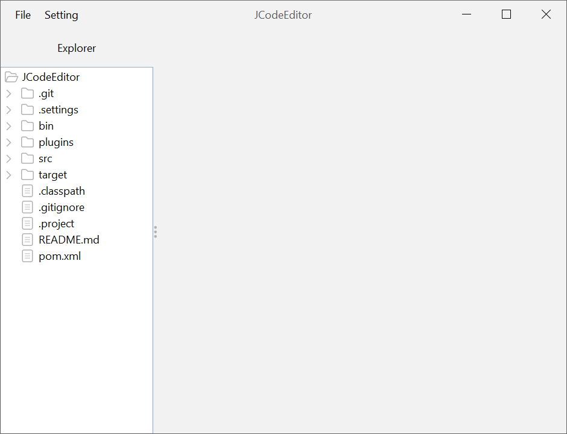
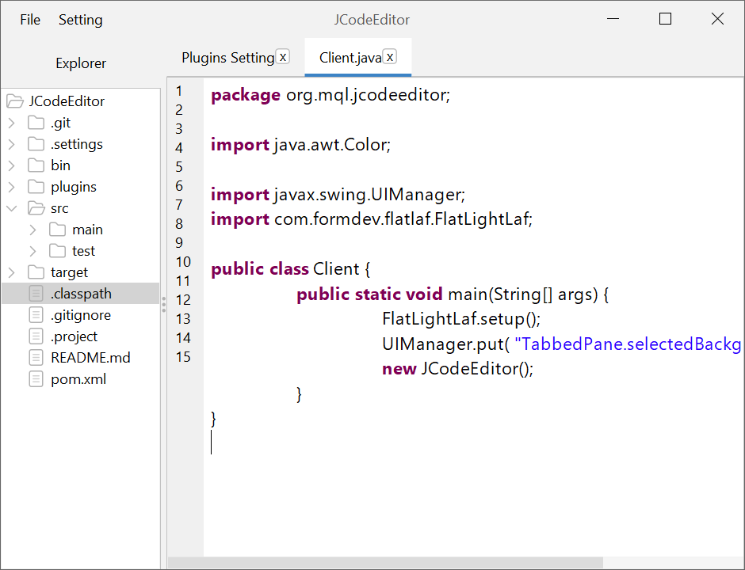
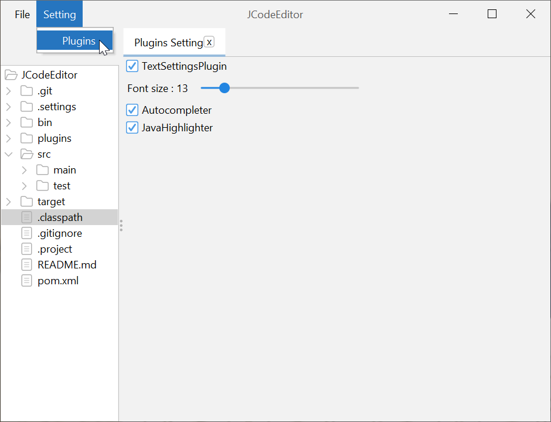
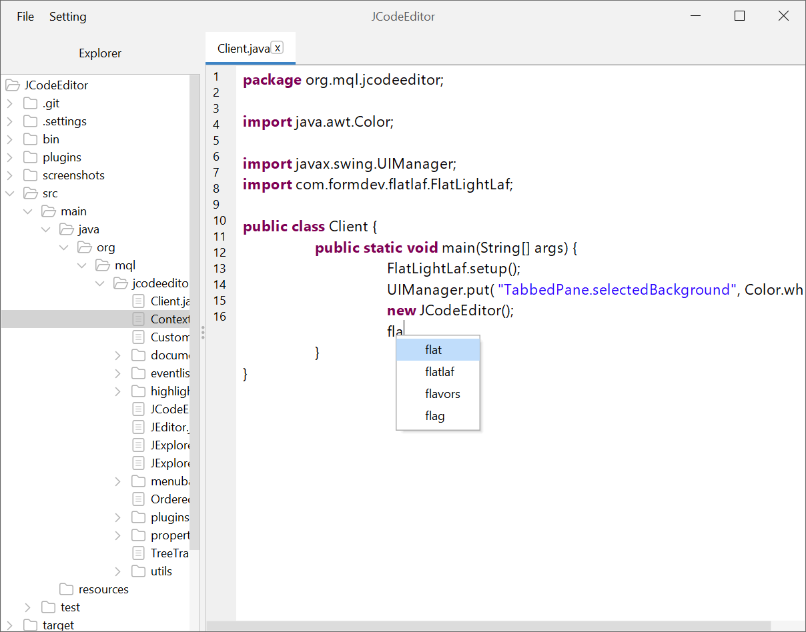

# JCodeEditor
a code editor build with java, the base editor is very simple, a file explorer and an editor to view and edit files, more features are added using plugins. 
the editor use FlatLaf look and feel, and comme with basic plugins like : 
- [code highlighting](https://github.com/laktam/java-highlighter-plugin)
- [autocompletion](https://github.com/laktam/autocompletion-plugin)
- [text setting changer](https://github.com/laktam/TextSettingsPlugin)

## Screenshots

  

